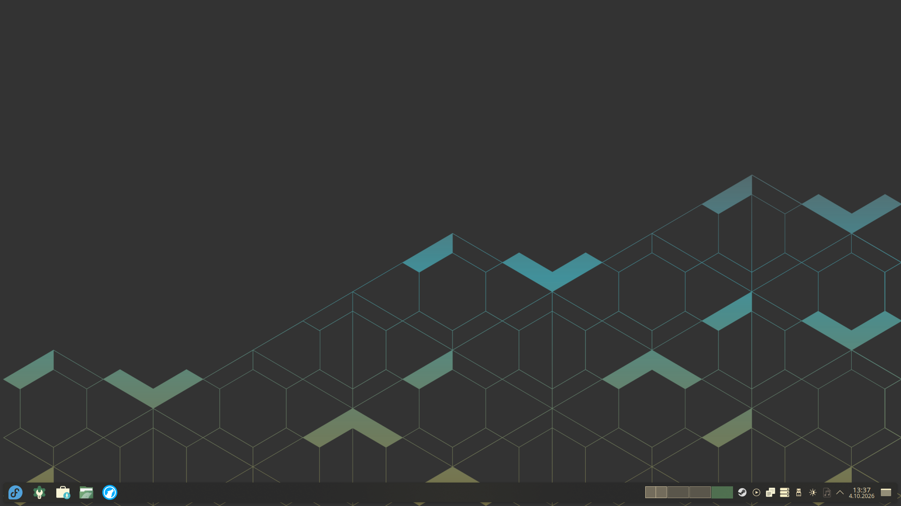
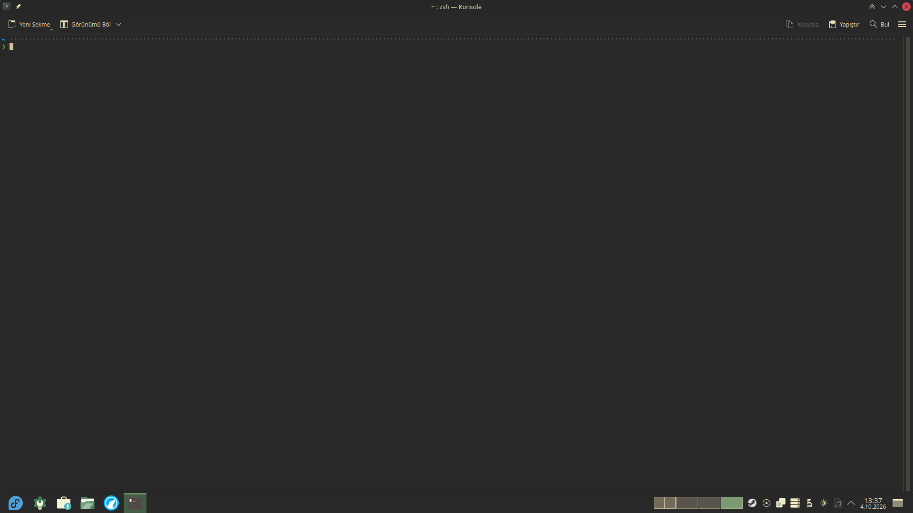
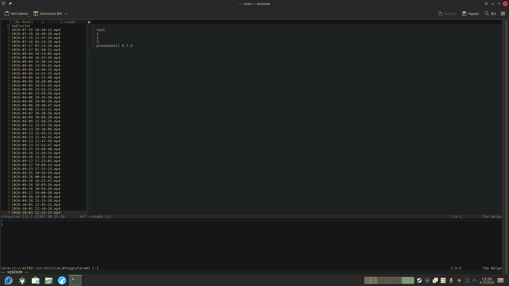

# Dotfiles

My personal Linux desktop configuration files.

Currently based on Fedora KDE Plasma + Wayland.

## Contents

* **Zsh**

  * Zsh
  * Oh My Zsh
  * Powerlevel10k
  * Custom aliases

* **Neovim**

  * Lazy.nvim
  * Gruvbox Material

* **Konsole**

  * Gruvbox Material Medium Dark
  * Custom profile

## Wallpaper

The included wallpaper is from the COSMIC desktop environment.

**License:** [CC BY-SA 4.0](https://creativecommons.org/licenses/by-sa/4.0/)

The wallpaper is not my original work and remains licensed under its original license.
